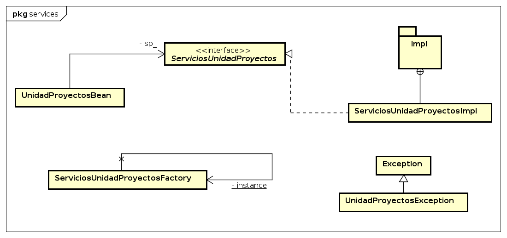

# UP-TEHO

ESCUELA COLOMBIANA DE INGENIERÍA JULIO GARAVITO

PROCESOS DE DESARROLLO DE SOFTWARE 2017-1

PROFESOR: Hector Fabio Cadavid Rengifo [Dueño del Producto]

INTEGRANTES: 

* Daniel Ospina [TEAM] [SCRUM MASTER]
* Andrés Felipe Pardo [TEAM]
* Juan Villate [TEAM]
* Jefferson Castañeda [TEAM]
* Juan Camilo Mantilla [TEAM]
* Gabriel Peña [TEAM]

## DESCRIPCIÓN DEL PRODUCTO

El proyecto fue planteado como una solución para el registro de los programas de Postgrado, manejados por la Unidad de Proyectos de la Escuela Colombiana de Ingeniería Julio Garavito.
Su propósito principal es el de poder mantener un control más organizado de las planeaciones que se llevan y se hacen para la programación semanal de los cursos, automatizando el proceso actual, permitiendo un manejo de registros historicos a largo plazo.

La función principal del proyecto permite ver un reporte de programación semestral, detallando las diferentes materias inscritas, con sus datos respectivos.

El botón de consultar permite conocer los datos especificos para las sesiones existentes de la materia seleccionada, con la opcion de agregar una nueva sesion, acorde al horario del profesor.

Se tiene un reporte de salones, el cual permite ver que tipo de salones de cada tipo están disponibles en diferentes fechas, permitiendo buscar por periodo.

También hay un reporte de las Materias, organizadas por el programa.

Para la programación de los cursos, se tiene su registro propio, al registrar un curso, este aparece disponible en el reporte de programación, donde es posible definir sus sesiones.

## ARQUITECTURA Y DISEÑO DETALLADO
### Modelo Entidad Relación

### Diagrama de Clases
El modelo se encuentra seccionado en sus partes más importantes

#### Servicios

#### Entidades

#### Mappers

#### DAOs

#### MyBatis

## DESCRIPCION DEL PROCESO

### Metodología
La forma de planeamiento utilizada por el equipo se hizo siguiendo el modelo de SCRUM, el cual consiste en dividir los requerimientos del proyecto en diferentes "historias de usuario", las cuales son valoradas con "puntos de historia" bajo una votación del equipo. Estas son registradas bajo el nombre de "Backlog del proyecto". Para cada Sprint se se define el "Backlog del Sprint" escogiendo un número determinado de historias de usuario, las cuales son divididas entre los integrantes del equipo dependiendo del valor que cada una de estas tenga.
Para el trabajo del proyecto, se utilizó la funcionalidad de github conocida como *fork*, la cual crea una copia vinculada directamente con el repositorio principal, en donde cada integrante puede realizar su progreso y subir sus cambios a su propia version del proyecto. Una vez se tenga una versión correcta y funcional de lo que cada integrante haya implementado, se hace un *pull-request* al repositorio principal, lo cual mezcla los cambios realizados por el integrante con los ya presentes, manteniendo el orden cronológico de los cambios.

### Backlog del proyecto
El backlog del proyecto puede accederse [haciendo click aqui](https://trello.com/b/bZFNLwbJ/2017-1-proypdsw-pcvpmo "Backlog UP-TEHO")
